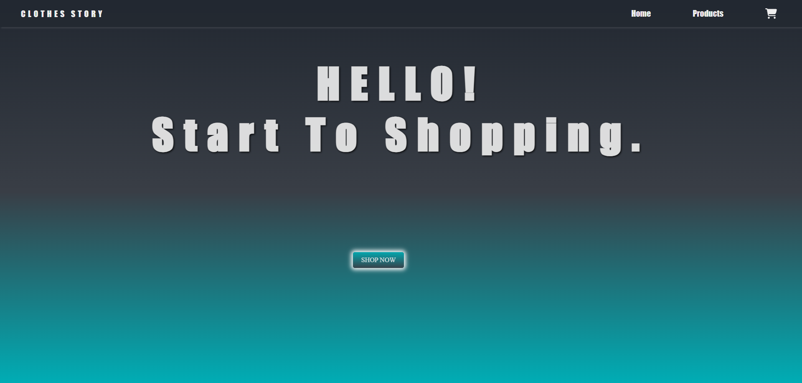
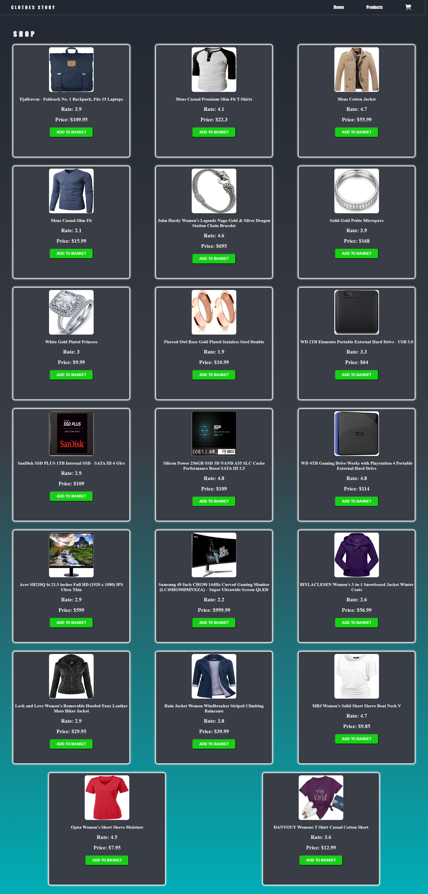
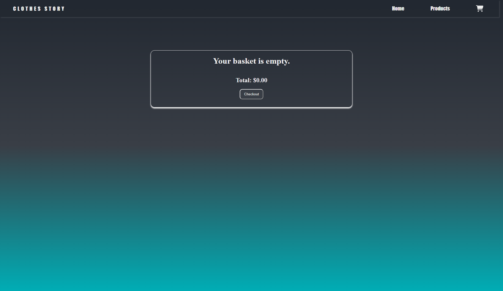

# 🛍️ Clothes Story

**Clothes Story** is a simple e-commerce web application built with React and Vite. This project allows users to browse products, add or remove items from the cart, and view product details. While it doesn't include a payment gateway, it demonstrates a functional front-end shopping experience. 

---

## 🚀 Features

- 🛒 **Cart System**  
  - Add and remove products from the shopping cart
- 👕 **Product Display**  
  - View a variety of clothing products with images and details
- 🏠 **Homepage Navigation**  
  - Smooth navigation across the homepage and product pages
- ⚡ **Fast Performance**  
  - Built with Vite for fast development and performance

---

## 🛠️ Tech Stack

| Layer         | Technologies                |
|---------------|-----------------------------|
| Frontend      | React, Vite, CSS            |
| Tools         | Git, GitHub, VS Code        |

---

###  Home Page


###  Product Page


### Basket Page


---
## 📦 Getting Started

Clone the repository and install dependencies:

```bash
git clone https://github.com/kuyucucaner/Clothes-Story.git
cd Clothes-Story
npm install
npm run dev
